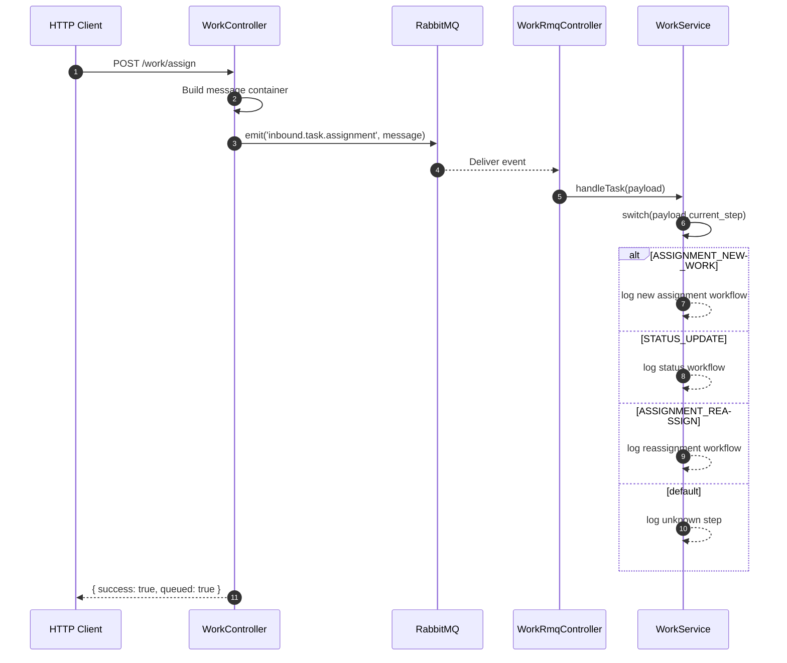

# RabbitMQ Event Flow

This is the event-driven flow:
- HTTP request enters the app
- controller emits an event to RabbitMQ
- RabbitMQ delivers the message to the consumer
- the service decides what to do based on `current_step`
